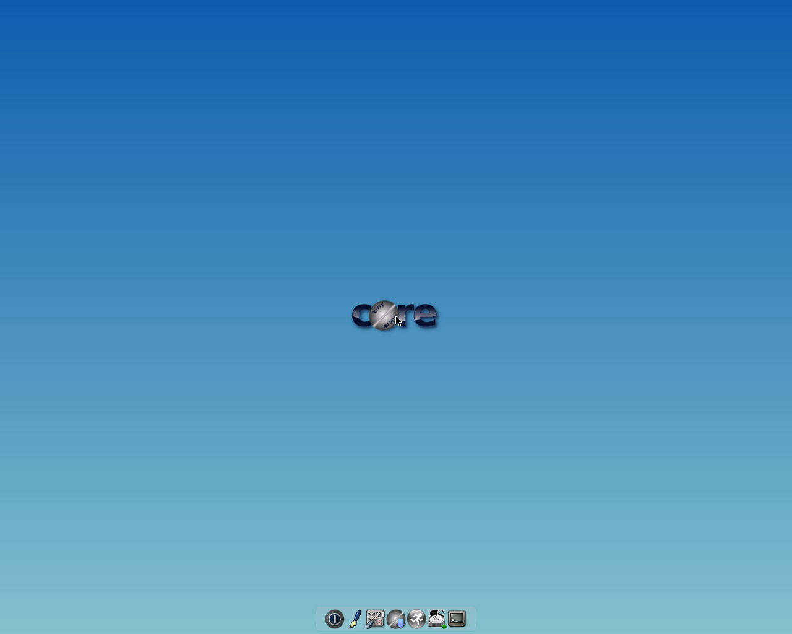
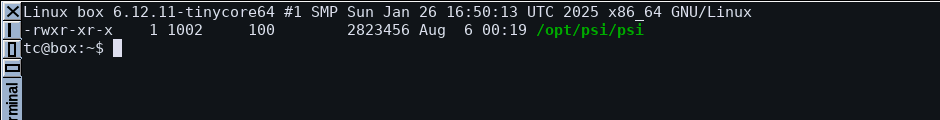
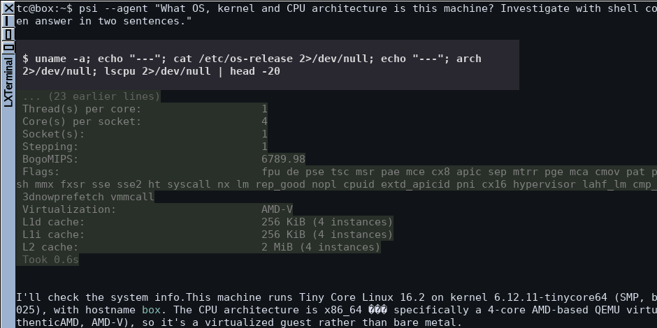
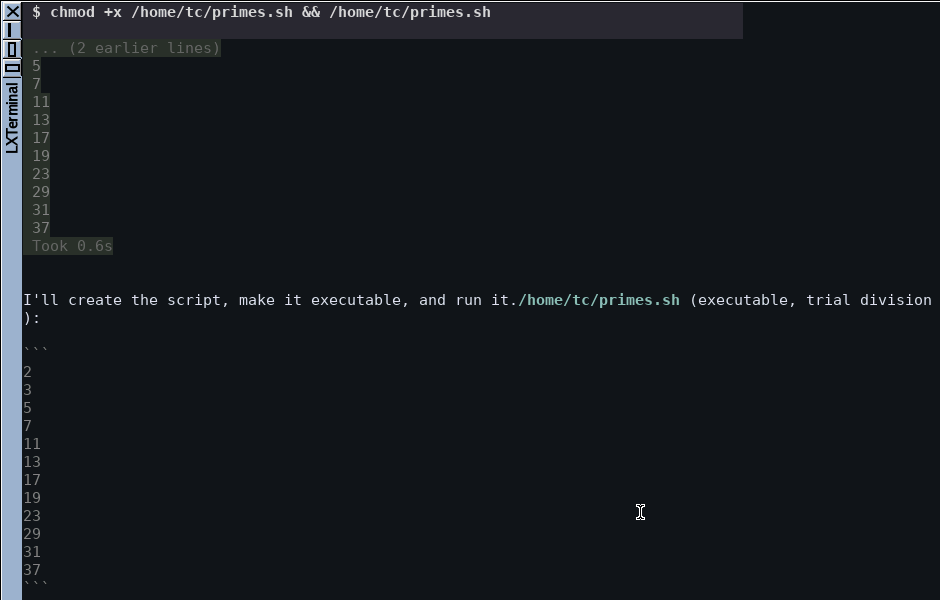
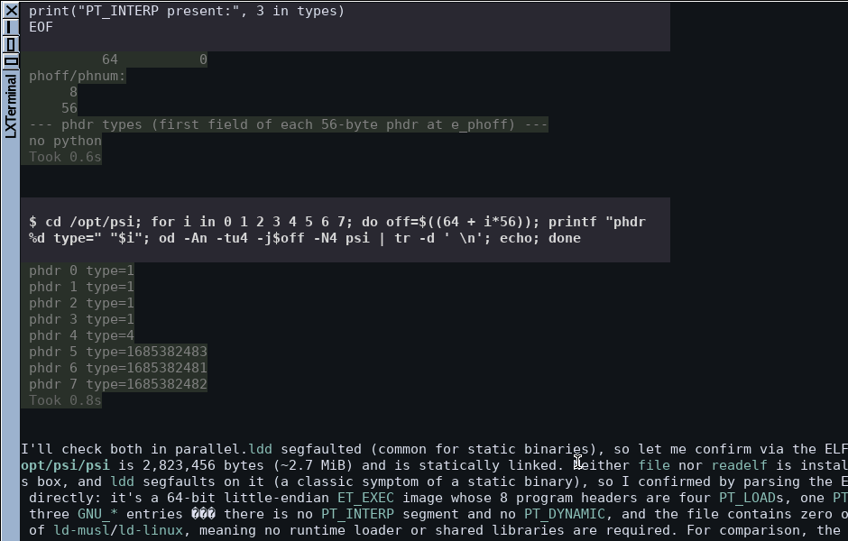

# Gallery

Screenshots of psi running in constrained environments. The point of each entry
is what the host *doesn't* have.

## psi on Tiny Core Linux 16.2 (x86_64)

Tiny Core is a ~40 MB distribution that boots entirely into RAM. The image below
has no compiler, no `git`, no `python`, no `file`, no `readelf` and no `ldd`.
psi is a single 2.8 MB statically linked binary dropped into `/opt/psi`; nothing
else was installed to make it run.

The VM is reproduced by `tinycore/build.sh` + `tinycore/run-vm.sh`, which bake
psi into the TinyCore initrd and expose the desktop over VNC.

### The desktop

Stock TinyCorePure64: `flwm` window manager, `wbar` dock, Xfbdev on a vesafb
framebuffer. 4 GB RAM, no KVM — plain TCG emulation.

### What psi costs

`2,823,456` bytes, statically linked. That is the whole install.

### Identifying its own host

Asked what it is running on, psi shells out to `uname`, `/etc/os-release` and
`lscpu`, then reports Tiny Core 16.2 on kernel 6.12.11-tinycore64 — and notices
from the `hypervisor` CPU flag and `AMD-V` virtualization line that it is a
guest rather than bare metal.

### Writing and running code

Asked for a prime sieve, psi writes `/home/tc/primes.sh`, marks it executable,
runs it, and shows the output — a full write/exec/verify loop on a box with no
development tooling at all.

### Working around missing tools

The most illustrative one. Asked whether its own binary is statically linked,
psi reaches for `file`, `readelf` and `ldd` — none of which exist here, and
`ldd` segfaults on a static binary. So it parses the ELF header directly with
`od`, walks the eight program headers, and concludes from the absence of
`PT_INTERP` and `PT_DYNAMIC` that no runtime loader is involved.

That is the argument for a small agent in one screenshot: the environment could
not have been less accommodating, and it still got there.
